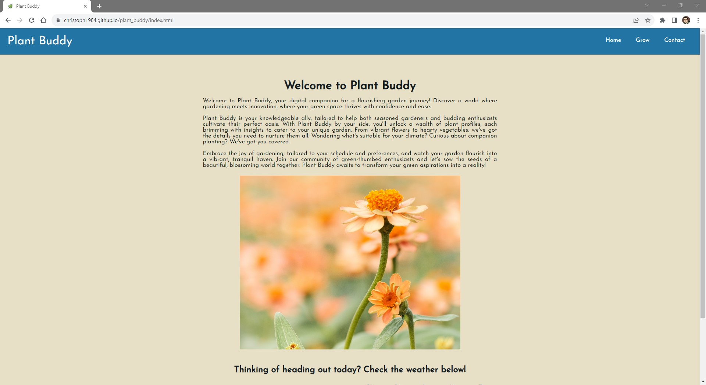
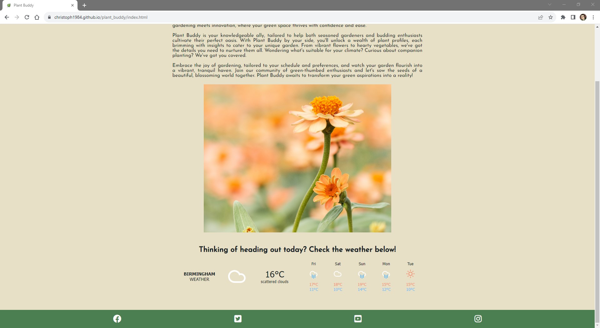
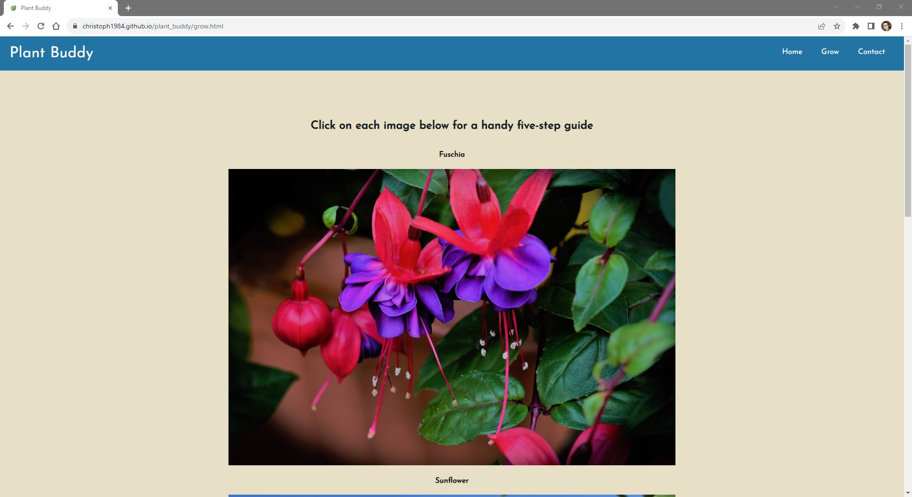
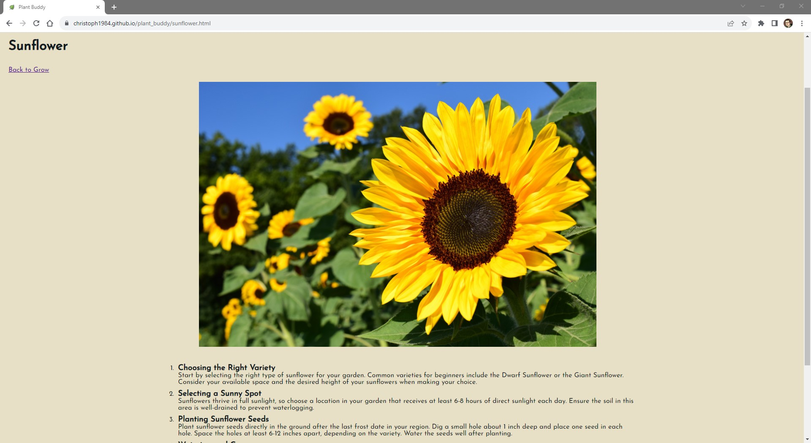
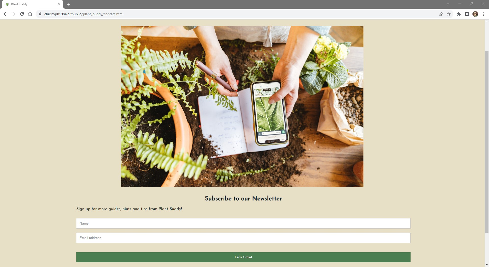
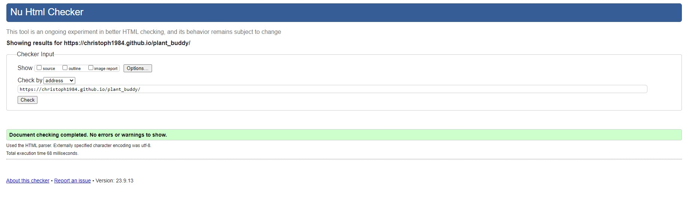
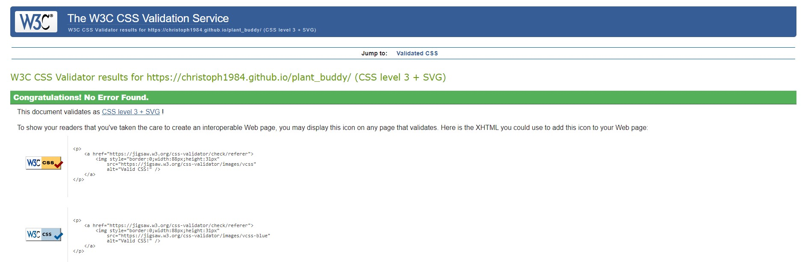

# Welcome to Plant Buddy

Plant Buddy is a small, self contained static website, built using HTML & CSS. The content is themed around providing handy tips and guides to beginner gardeners. As such the site is intended for use on mobile devices primarily (as the user might be in the garden when they need assistance), however the site is also responsive, so functions well on larger screens as well. The site could easily be expanded with further guides going forwards. 

[Link to live page](https://christoph1984.github.io/plant_buddy/)

## Table of contents:
- [Plant Buddy](#welcome-to-plant-buddy)
  - [Table of contents](#table-of-contents)
  - [UX Design](#ux-design)
  - [Structure](#structure)
    - [Home Page](#home-page)
    - [Grow Page](#grow-page)
    - [Plant Pages](#plant-pages)
    - [Contact Page](#contact-page)
  - [Design](#design)
    - [Wireframes from Lucid](#wireframes-from-lucid)
    - [Palette choice from Coolers](#palette-choice-from-coolers)
  - [Testing](#testing)
  - [Version Control](#version-control)
    - [Cloning the Respository](#cloning-the-repository)
    - [Forking](#forking)
    - [Deployment](#deployment)
  - [Technologies](#technologies)
  - [Credits](#credits)

## Key features:

* Landing page with clear and concise information to welcome the user and explain the purpose of the site.
* Navigation bar with simple, prioritised links that will take the user directly to the information requested.
* Four additional pages, three featuring one 5-step growing guide and one featuring a newsletter sign-up form.

## UX Design

First time user:
* Should easily understand the purpose of the website, at a glance.
* Should be able to easily and intuitively navigate the website in order to find the desired information.
* Should be able so easily sign up to receive the Plant Buddy news letter.
* Should be able to quickly locate the Plant Buddy social network links.
 
All the users want to be able to access and view the website comfortably on mobile and tablet devices.

## Structure

### Home Page
* Introduces the website and why it might be useful for the user.
* Grabs user's attention with a striking image and simple navigation bar to easily allow the user to navigate through the site. When the site is viewed on a mobile device, the nav bar stacks and removes the Home button.
* An IFRAME containing a live weather forecast is also included to aid a potential user who is planning to go outside in to their garden.
* A Social Media footer containing four links to external sites (repeated on all pages). 

### Grow Page
* Provides users with links to each of the flower types that Plant Buddy currently has guides for.
* Each of these links is contained within an image of the flower, so the user knows straight away which flower is which, as they might not know the name, but recognise the image.

### Plant Pages
* Each page contains an image of the flower in question.
* Under the heading of the flower, there is a link to take the user back to the Grow page.
* Below the image is a simple 5-step guide to growing and caring for the flower in question.

### Contact Page
* Allows the user to sign up to the Plant Buddy newsletter.
* Both fields are validated so won’t allow a blank name or non-email address response.

## Design 

### Wireframes from Lucid
NOTE: Palette has changed since the wireframe stage was completed

* Wireframe design for larger screens:

* Wireframe design for mobile screens:

### Palette choice from Coolers

## Testing

* Browser Compatibility

| Browser | Test | Result  |
--- | --- | ---
Google Chrome | No appearance, responsiveness or functionality issues.| Pass
Safari | No appearance, responsiveness or functionality issues. | Pass
Mozilla Firefox | No responsiveness or functionality issues.| Pass
Microsoft Edge | No appearance, responsiveness or functionality issues. | Pass

* Device Compatibility

| Device | Test | Result  |
--- | --- | ---
Google Pixel 6 Pro | No appearance, responsiveness or functionality issues.| Pass
iPhone SE| No appearance, responsiveness or functionality issues. | Pass
iPhone 13 | No responsiveness or functionality issues.| Pass

* Lighthouse testing (site tested in Lighthouse repeatedly throughout development)

* W3C HTML validation - PASS

* W3C CSS validation - PASS

## Version Control
<ul>
<li>The website was developed through Codeanywhere IDE.</li>
<li>Code has been pushed to repository on Github with following git commands:</li>
  <ul>
  <li>git add . - to add files ready to commit</li>
  <li>git commit -m "message" - to commit the code to local repository ready to be pushed</li>
  <li>git push - final command used to push committed code to remote repo on Github</li>
  </ul> 
</ul>

### Cloning the Repository
<ul>
<li>Navigate to the GitHub Repository 'christoph1984/plant_buddy'</li>
<li>Click 'Code' drop down menu - a green button shown right above the file list.</li>
<li>Copy the URL of the repository using 'HTTPS', 'SSH'or 'Github CLI'.</li>
<li>Open Git Bash.</li>
<li>Change the current working directory to the location where you want the cloned directory.</li>
<li>Type 'git clone', and then paste the URL copied earlier.</li>
<li>Press enter to create local clone. A clone of the repository will now be created.</li>
<li>For more details on how to clone the repository in order to create a copy for own use refer to the site: https://docs.github.com/en/repositories/creating-and-managing-repositories/cloning-a-repository.</li>
</ul>

### Forking
<ul>
<li>Navigate to the GitHub Repository 'christoph1984/plant_buddy’</li>
<li>Click 'Fork' located towards top right corner on GitHub page.</li>
<li>Select 'owner' for the forked repository from the dropdown menu under 'owner'.</li>
<li>It will create forked repo under the same name as original by default. But you can type a name in 'Repository name' or add a description in 'Description' box.</li>
<li>Click on 'Create fork'. A forked repo is created.</li>
<li>Forking enables you to implement modifications without impacting the original project. You can propose changes by submitting a pull request. Subsequently, the Project Owner can evaluate the pull request, decide whether to accept the proposed changes, and merge them.</li>
<li>When you have fork to a repository, you don't have access to files locally on your device, for getting access you will need to clone the forked repository.</li>
</ul>

### Deployment
<ul>
<li>Go to GitHub repository.</li>
<li>Click on 'Settings'.</li>
<li>Click on 'Pages'(tab on the left sidebar).</li>
<li>Scroll to 'Build and deployment'/'Source' section.</li>
<li>Find the sub-section 'Branch'.</li>
<li>From the drop-down menu 'none'/'select branch' and choose source 'main' (or 'master').</li>
<li>Click 'Save'</li>
<li>Wait until you can see a link for deployed page within GitHub Page section. This can take a while. Once the page updates you will see a message: Your site is live at https://christoph1984.github.io/plant_buddy/</li>
</ul>

## Technologies
* HTML - used to create the main structure of the website.
* CSS - used to style the website.
* Codeanywhere built-in formatter to format structure for HTML and CSS files in the project.
* Codeanywhere IDE to develop the website.
* GitHub to host the source code and GitHub Pages to deploy and host the live site.
* Git to provide the version control to commit and push code to the repository.
* Google Fonts for typography.
* FontAwesome v5.15.4 for icons.
* Google Chrome Dev Tools for inspecting, debugging pages and testing layouts.
* Pexels - used to source the images for the website.
* Favicon.io to create the website favicon.
* Am I Responsive to create the Mockup image in this README.
* Google Chrome's Lighthouse to test accessibility for desktop and mobile devices.
* W3C HTML Markup Validator to validate the HTML Code.
* W3C Jigsaw CSS Validator to validate the CSS Code.
* Code Institute's Codeanywhere Template to generate the workspace for the project.

## Credits
* pexels.com - used to source all the images included in the website.
* Google Fonts - for fonts to use in website.
* FontAwesome for all the icons used in the website.
* W3Schools.com - used throughout the website for general help.
* CSS-Tricks - for guidance with Flexbox 
* Google
* Forecast7.com - weather forecast widget
* Lucid - for wireframe design
* A code snippet for the footer was adapted from the Love Running Project.
* Love Running Project - for general guidance.
* A code snippet for responsive navbar cards was adapted from W3Schools.
* The favicon.ico image for the website.

